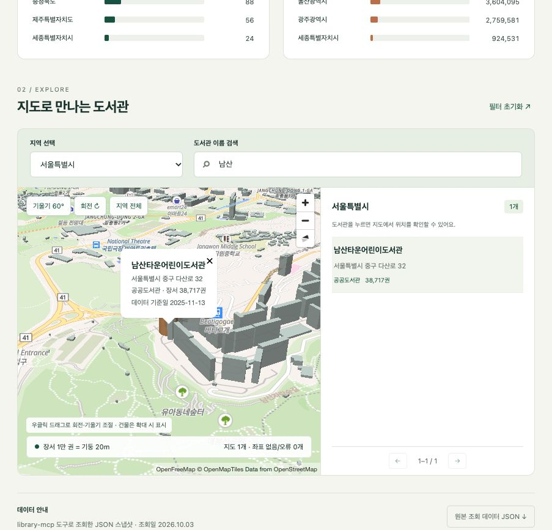

# 6장 MCP로 외부 도구와 데이터 연결하기

『코덱스 완벽 가이드』 6장 실습 자료입니다. 챗GPT 앱(macOS)과 Codex CLI 0.160.0, GPT-6.1-Sol(medium)로 진행했습니다. 작성 기준일은 2026년 10월 3일입니다.

| 폴더·파일 | 내용 |
|---|---|
| `README.md` | [실습 06] Notion MCP 연결 방법과 프롬프트 |
| `library-mcp/` | 06.5 [심화] 공공 데이터로 만든 MCP 서버와 3D 지도 웹앱 |

인증 정보, API 키, 개인 토큰은 이 자료에 포함하지 않습니다.

## [실습 06] Notion MCP로 작업 결과 정리하기

5장 [실습 05]에서 만든 습관 트래커의 인계 노트(`docs/NOTES.md`)를 Notion 페이지로 정리합니다.

### 1. Notion MCP 서버 추가

챗GPT 앱에서 [Settings > Plugins > MCPs]를 열고 [Add > Add MCP server]를 누릅니다.

| 항목 | 값 |
|---|---|
| Name | `notion_mcp` |
| Type | Streamable HTTP |
| URL | `https://mcp.notion.com/mcp` |

CLI에서는 다음 명령으로 같은 서버를 추가할 수 있습니다. 앱과 CLI는 `~/.codex/config.toml`을 함께 씁니다.

```sh
codex mcp add notion_mcp --url https://mcp.notion.com/mcp
codex mcp login notion_mcp
```

### 2. OAuth로 로그인

목록에서 `notion_mcp` 옆의 [Authenticate]를 누르면 브라우저에 Notion 승인 화면이 열립니다. 연결할 워크스페이스와 요청 권한을 확인하고 승인합니다.

### 3. 계획을 먼저 확인하고 페이지 만들기

```text
@notion_mcp docs/NOTES.md 내용을 Notion 페이지로 정리해줘.
만들기 전에 페이지 제목, 만들 위치, 내용 구성을 먼저 보여 주고 내 확인을 받아줘.
```

계획을 확인한 뒤 진행하라고 답하면 코덱스가 Notion에 페이지를 만들고 링크를 알려 줍니다. 외부 서비스에 무언가를 만들거나 바꾸는 작업은 이렇게 실행 전에 계획을 먼저 확인하세요.

## 06.5 [심화] 공공 데이터로 나만의 MCP 서버 만들기

공식 MCP 서버가 없는 데이터는 코덱스에게 MCP 서버를 만들게 해서 연결할 수 있습니다. `library-mcp/`는 공공데이터포털의 [전국도서관표준데이터](https://www.data.go.kr/data/15013109/standard.do)를 읽는 STDIO MCP 서버와, 그 서버로 모은 데이터를 MapLibre GL JS + OpenFreeMap 3D 지도로 보여 주는 웹앱입니다.

> **실습 전용입니다.** 이 서버와 데이터, 웹앱은 개인 학습과 실습에만 사용하세요. 서버나 웹앱을 인터넷에 배포하거나, 가공한 데이터를 공개·재배포하지 마세요. 공공데이터마다 이용 조건이 다르고, 조건이나 관련 법령을 어기면 법적 책임을 질 수 있습니다. 실제로 공개하려면 데이터 페이지의 이용 조건을 먼저 확인하세요. 이 서버는 전화번호 열을 읽지 않습니다.

저장소에는 원본 CSV와 수집한 JSON(`web/data/`)을 넣지 않았습니다. 직접 내려받고 만들어 보세요.

### 1. 데이터 준비와 서버 빌드

1. 공공데이터포털에서 전국도서관표준데이터 CSV를 내려받아 `library-mcp/전국도서관표준데이터.csv`로 저장합니다. 파일은 CP949로 인코딩되어 있습니다.
2. 서버를 빌드하고 테스트합니다.

```sh
cd library-mcp
npm ci
npm run build
npm test
```

### 2. 챗GPT 앱에 STDIO 서버로 등록

[Settings > Plugins > MCPs]에서 [Add > Add MCP server]를 열고 다음과 같이 입력합니다.

| 항목 | 값 |
|---|---|
| Name | `library-mcp` |
| Type | STDIO |
| Command to launch | node 실행 파일의 절대 경로(`which node`로 확인) |
| Arguments | `library-mcp/dist/server.js`의 절대 경로 |

### 3. 책에서 사용한 프롬프트

서버 만들기:

```text
이 폴더의 전국도서관표준데이터.csv(공공데이터포털에서 받은 파일)를 읽는 MCP 서버를 Node.js로 만들어줘. STDIO 방식으로 동작하고, MCP 공식 TypeScript SDK를 써줘. 도구는 세 가지야. 시도·시군구·키워드로 도서관을 찾는 search_libraries, 시도별 도서관 수와 장서 수를 집계하는 stats_by_region, 도서관 하나의 상세 정보를 주는 get_library. CSV 인코딩을 먼저 확인해서 올바르게 읽고, 전화번호는 결과에서 빼줘. 다 만들면 MCP 서버를 실제로 실행해 도구 목록과 도구 하나의 호출 결과를 확인하고, 챗GPT 앱에 등록할 때 넣을 명령과 인자를 알려줘.
```

시각화 웹앱 만들기:

```text
library-mcp MCP 서버의 도구로 전국 도서관 데이터를 조회해서 한 페이지짜리 시각화 웹앱을 만들어줘. web 폴더에 HTML, CSS, JavaScript로 만들고, 외부 라이브러리는 지도 표시용 Leaflet만 CDN으로 써도 돼. 1) 시도별 도서관 수와 장서 수 막대 차트, 2) 시도를 고르면 그 지역 도서관을 지도에 점으로 표시, 3) 도서관 이름 검색. 데이터는 반드시 library-mcp 도구로 가져와서 JSON 파일로 저장해 쓰고, 어떤 도구를 몇 번 호출했는지 마지막에 알려줘. 완성하면 로컬 서버로 열어서 화면을 확인해줘.
```

3D 지도로 바꾸기:

```text
지도를 더 멋지게 바꾸고 싶어. Leaflet 대신 MapLibre GL JS와 OpenFreeMap 지도 타일을 써서 3D로 보여줘. 건물은 3D로 세우고, 도서관 위치는 장서 수에 비례하는 높이의 3D 기둥으로 표시해줘. 지도를 기울이고 회전할 수 있게 하고, 시도를 고르면 그 지역으로 부드럽게 날아가게 해줘. 지도 출처 표시는 꼭 남겨 주고, 데이터는 지금 JSON을 그대로 써. 완성하면 화면을 확인해줘.
```

### 4. 웹앱 실행

```sh
python3 -m http.server 8765 --bind 127.0.0.1 --directory web
```

http://127.0.0.1:8765 에서 엽니다. 내 컴퓨터에서만 실행하세요. 지도 아래의 OpenFreeMap·OpenMapTiles·OpenStreetMap 출처 표시는 지우지 마세요.



책을 쓸 때의 결과: 서버 제작 4분 27초(3,601행, 테스트 4개 통과), 웹앱 제작 9분 5초(MCP 도구 호출 3,641번), 3D 전환 7분 9초.

자세한 서버 구조는 [library-mcp/README.md](library-mcp/README.md), 웹앱은 [library-mcp/web/README.md](library-mcp/web/README.md)를 보세요.
