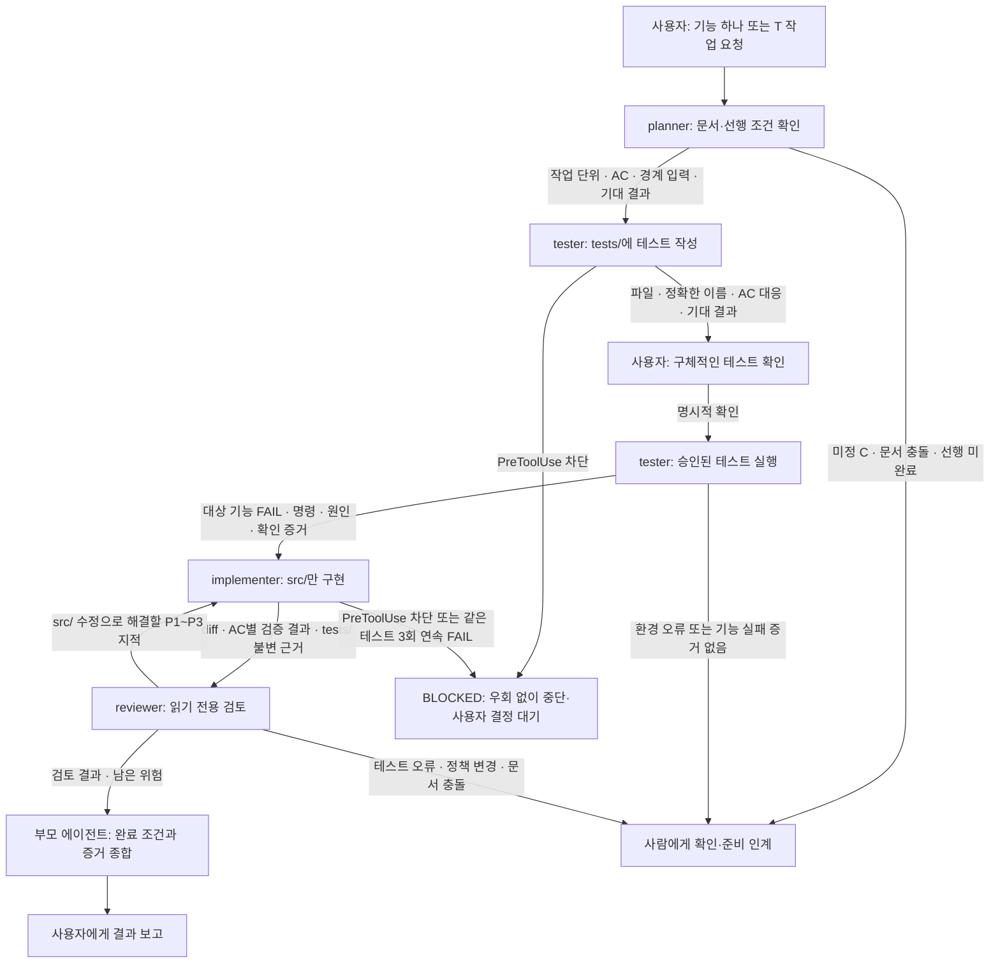

# 16장 실습: 역할별 커스텀 에이전트

프로젝트의 `.codex/agents/`에 역할별 TOML 파일을 둔다. 모든 에이전트는 [AGENTS.md](../AGENTS.md), [헌법](../.specify/memory/constitution.md), [PRD](prd.md), [수용 기준](acceptance.md), [작업 목록](tasks.md)을 읽고 따른다. 이 설정 작성 자체는 기능 구현이나 에이전트 실호출 결과가 아니다.

| 에이전트 | 언제 사용하나 | 파일 변경 범위 | 전달하는 결과 | 모델 |
|---|---|---|---|---|
| [planner](../.codex/agents/planner.toml) | 기능 하나의 계획을 세울 때 | 없음 | 작업 단위, T·US·AC·C, 선행 근거, 테스트 입력·기대 결과, 완료 조건 | 부모 설정 상속 |
| [tester](../.codex/agents/tester.toml) | 계획을 받아 구현 전 테스트를 작성할 때 | `tests/`의 해당 기능 테스트만 | 테스트 파일·이름·AC 대응, 사용자 확인, 실제 실패 명령·원인 | 부모 설정 상속 |
| [implementer](../.codex/agents/implementer.toml) | 사용자 테스트 확인과 실제 실패 증거가 모두 있을 때 | `src/`만 | 변경 범위, AC별 실행 결과, 미검증 범위 | `gpt-6.1-sol` |
| [reviewer](../.codex/agents/reviewer.toml) | 구현 결과를 완료 판단 전에 검토할 때 | 없음 | P1~P3 지적, 근거와 재현 조건, 남은 위험 | `gpt-6-astra` |

## 작업 순서와 인계 그래프

화살표는 부모 에이전트가 전달할 인계 내용이다. 파일을 만들었다고 네 에이전트가 자동으로 순차 실행되는 것은 아니다. 부모는 한 단계의 결과를 확인한 뒤 다음 역할을 호출하며, 테스트 작성과 구현을 동시에 진행하지 않는다.

헌법 III에 따라 **테스트 작성 → 사용자 명시적 확인 → 대상 기능의 실제 실패 확인 → 구현**을 지킨다. 일반적인 기능 구현 요청·문서 승인으로 사용자 테스트 확인을 대신하지 않는다. 환경·인증 오류, 실행하지 않은 테스트, `skip/todo`는 실패 확인 관문을 충족하지 않는다. 이미 통과하는 기능은 억지로 실패시키지 않고 계획과 현재 상태를 다시 확인한다.

리뷰에서 `src/` 수정으로 해결할 문제는 implementer가 고치고 검증한 뒤 다시 리뷰한다. 테스트 오류는 별도 테스트 작성 단계와 재확인을 거친다. 정책 변경에 따른 테스트 수정은 사람이 정책·문서·테스트를 갱신한 뒤 사용자 확인·실패 확인을 다시 거친다. reviewer는 파일을 고치지 않는다.

## 인계 시 확인할 내용

| 인계 | 필수 내용 |
|---|---|
| planner → tester | 기능·T 범위, 관련 US·AC·C, 선행 완료 근거, 확정/미정 구분, GIVEN/WHEN/THEN과 경계값, 대상 경로·검증 명령·완료 조건 |
| tester → 사용자 → implementer | 테스트 파일·정확한 이름·AC 대응·입력/기대값, 사용자 명시적 확인의 근거, 실제 실행 명령·실패 이유, 환경 오류와 기능 실패 구분 |
| implementer → reviewer | 승인된 계획·테스트·확인/실패 근거, 변경 파일·diff, tests/ 불변 근거, T·AC별 실행 명령·결과, 미검증 범위 |
| reviewer → 부모/implementer | P1~P3, 파일·줄·T/AC, 재현 조건·영향·수정 방향, 정책/테스트 확인이 필요한 문제, 검토 범위와 남은 위험 |

P1은 핵심 흐름 중단·권한 침해·중대한 금액/데이터 오류, P2는 일반 기능 오류·AC 위반·회귀, P3는 영향이 제한된 결함이나 유지보수 문제로 보고한다. 지적이 없으면 그 사실과 검토 한계를 함께 보고한다.

## 권한과 훅의 적용

planner와 reviewer는 `sandbox_mode = "read-only"`, tester와 implementer는 `workspace-write`를 기본 설정으로 둔다. `tests/`와 `src/`의 역할별 쓰기 범위는 `developer_instructions`의 작업 규칙이며, `workspace-write` 자체가 특정 폴더만 쓰도록 격리하는 것은 아니다. 부모 세션의 런타임 권한 설정이 기본 샌드박스 설정보다 우선할 수 있으므로 파일 변경 금지 지시도 함께 둔다.

기존 [guard.sh](../.codex/guard.sh)는 테스트 파일 변경을 차단하도록 정의되어 있다. **tester도 예외가 아니다.** 실제 PreToolUse 차단이 발생하면 다른 도구·명령·경로로 우회하거나 훅을 수정하지 않고, 차단한 훅·작업·이유·관련 T/AC와 선택지를 보고하여 사용자 결정을 기다린다. 이번 설정 작업은 훅 코드·신뢰 설정을 바꾸지 않는다.

Stop 검증 실패는 [AGENTS.md](../AGENTS.md)의 현행 규칙대로 승인된 범위에서 구현을 수정하고 재검증한다. 같은 테스트가 세 번 연속 실패하면 추가 수정·네 번째 실행을 멈추고 테스트 `FAIL`, 작업 `BLOCKED`로 인계한다. [harness.md](harness.md)의 중단 설명과 AGENTS.md가 충돌하는 경우 AGENTS.md가 명시한 우선순위를 따른다. 에이전트의 파일 변경 범위 밖인 실패 기록은 부모에게 응답으로 전달하고 부모가 문서 기록을 맡는다.

검증 결과는 `PASS / FAIL / BLOCKED / NOT_RUN`으로 구분한다. 정적 확인·모의 처리·브라우저·토스 테스트 실연결 결과를 각각 기록한다.

설정 형식 근거: [OpenAI 공식 Custom agents 문서](https://learn.chatgpt.com/docs/agent-configuration/subagents#custom-agents). 프로젝트별 TOML 파일에 `name`, `description`, `developer_instructions`와 필요에 따라 모델·샌드박스 설정을 지정한다.

## 현재 MCP 실습의 인계와 사람 승인

사용자가 기존 테스트 이름을 확인하고 C-12의 터미널 승인 파일 방식을 결정했다. 이번 단계는 tester가 AC-18-7~10을 갱신하는 데서 멈춘다. 정책 변경 테스트 수정은 사용자가 tester에게 명시적으로 지시한 별도 테스트 작성 단계이다. 가드·테스트 작성 스위치·승인 경로는 에이전트가 변경하지 않는다.

사람의 결제 링크 승인은 사람이 직접 `npm run approve -- <holdId>`를 실행해 `.codex/approvals/<holdId>` 파일을 만드는 절차이다. 이는 개발 테스트 확인과 별개의 승인이다. 서버는 자신의 유효 점유에 해당 파일이 있는지 읽어 확인하며, 파일이 없으면 APPROVAL_REQUIRED·충전소/시간/금액 요약·승인 명령을 반환한다. 에이전트가 승인 명령을 실행하거나 승인 파일을 만드는 것은 금지한다.

사용자가 갱신 테스트를 확인하고 테스트 작성 스위치를 끈 뒤, 실제 실패 확인 → implementer 구현 → GPT-6-Astra reviewer 검토 → P1이 있으면 implementer 수정·재검증·재리뷰 순서로 진행한다. 지금은 테스트 실행·구현·리뷰를 진행하지 않는다. Stop 훅 실패가 발생해도 사용자 중단 지시를 우선한다.

## 커밋 후 구현·리뷰 실행 승인

사용자는 갱신 테스트를 커밋하고 테스트 작성 스위치를 끈 뒤 구현·리뷰 실행을 승인했다. 위 테스트 단계의 중단 지시는 이 후속 요청으로 해제되었다. 테스트 기준 커밋은 `5b15293`이며 승인된 테스트는 구현과 리뷰 중 변경하지 않는다.

누락 모듈의 import 오류를 기능 실패로 세지 않기 위해 implementer가 공개 API 골격만 준비하고 실제 RED를 실행했다. 결과는 MCP 테스트 59/59 FAIL, 수집/import 오류 0이었다. tester는 그 실행을 반복하지 않고 테스트·골격·실패 증거를 대조한 뒤 T-50~53·AC-18-1~10을 implementer에게 인계했다.

이어 implementer가 src/를 구현하고 검증 결과를 reviewer에게 전달한다. 부모는 의존성·npm script 연결과 검증 기록을 담당한다. reviewer는 GPT-6-Astra로 읽기 전용 검토하며 P1이 있으면 implementer 수정·재검증 → reviewer 재검토를 최대 두 번 수행한다. 두 번 후에도 P1이 남으면 추가 반복 없이 남은 문제를 보고한다. 같은 테스트의 세 번 연속 실패 및 PreToolUse 차단 규칙은 별도로 유지한다.

실행 결과: MCP 59개·전체 168개 테스트 및 타입 검사 PASS. 실제 stdio의 검색·점유·미승인 응답 PASS. reviewer의 P1~P3 지적은 없었으며 수정·재리뷰는 0회였다. 실제 승인 후 링크 제공은 미설정으로 BLOCKED, 사람용 실제 승인 CLI·토스 실연결은 NOT_RUN이다. 인계 표와 세부 근거는 [mcp-implementation.md](mcp-implementation.md)에 기록했다.

후속 T-54에서 사용자가 지정한 로컬 테스트 링크 형식을 구현했다. tester의 3개 RED 계약과 사용자 커밋 `93faed8`을 implementer에게 인계해 신규 3/3·전체 171/171·타입 PASS를 확인했고 GPT-6-Astra reviewer의 P1~P3 지적은 없었다. 이전 링크 제공 미설정은 이 시연용 URL 문자열 생성 범위에서 해소됐다. 실제 승인 파일 생성·checkout 페이지·결제·Codex 승인 UI 검증은 NOT_RUN이다. 후속 순서별 인계는 [local-checkout-plan.md](local-checkout-plan.md)에 기록했다.
